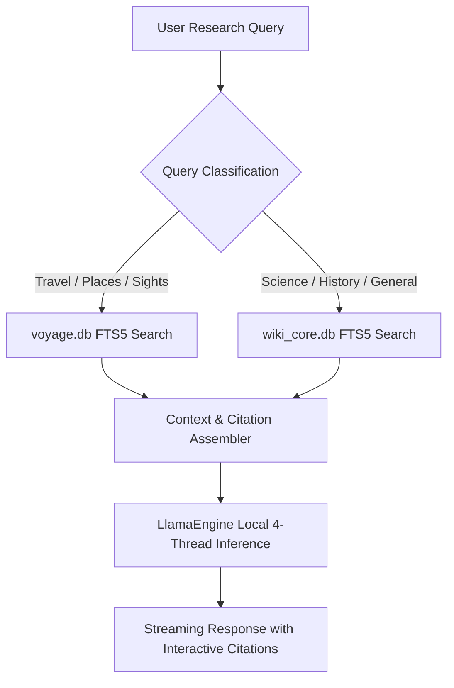

# NomadLM ⛺
### Offline AI Research Engine for Android

> An offline-first, native Android research intelligence engine designed to meet and exceed the bar for mobile research: a powerful assistant that runs completely disconnected from the internet, operates comfortably within standard mobile RAM budgets (8GB–12GB devices), and delivers real-time inference grounded in verified encyclopedic citations and worldwide places.

---

## 📌 Project Status & Verified Data Footprint

* **Inference Core:** Compact 3B reasoning architecture (`Llama-3.2-3B-Instruct` at `Q4_K_M`, ~2.02 GB) operating within a ~2.4 GB – 2.8 GB active RAM budget.
* **Offline Knowledge Store:** Dual-layer compressed SQLite database (~4.95 GB total):
  * **`voyage.db` (328 MB):** Complete Wikivoyage global collection covering **34,004 travel articles** and **549,160 searchable places** (cities, sights, restaurants, and hotels worldwide).
  * **`wiki_core.db` (4.62 GB):** Top **120,000 most-viewed English Wikipedia articles** from the FineWiki corpus, indexed with **4,645,950 searchable text chunks** and full redirect tables.
* **Total Phone Footprint:** **~7.0 GB** (Model + Full Knowledge Store), leaving over 13 GB free on a standard 20 GB phone partition.
* **Zero Network Permissions:** `android.permission.INTERNET` is explicitly blocked in `app.json`.

---

## 🛠 Architecture & Pipeline

### Reproducible Data Pipeline
The repository includes the complete open-source pipeline scripts used to build and verify the corpus:
* [`scripts/inspect_voyage.py`](scripts/inspect_voyage.py): Downloads and indexes the 328 MB global Wikivoyage database.
* [`scripts/download_wiki.py`](scripts/download_wiki.py): Resumable downloader for the full 21.3 GB FineWiki SQLite dump.
* [`scripts/extract_compact_wiki.py`](scripts/extract_compact_wiki.py) & [`scripts/finish_compact_wiki.py`](scripts/finish_compact_wiki.py): High-speed extraction filtering the top 120,000 articles by pageviews into `wiki_core.db` (4.62 GB).
* [`scripts/test_wiki_core.py`](scripts/test_wiki_core.py): Tests zstd block decompression and excerpt retrieval on device-ready SQLite databases.

---

## 📱 Hardware & Operating Profile

* **Target Hardware:** Android 10+ / GrapheneOS devices with 64-bit ARM (`arm64-v8a`) and 8GB+ RAM.
* **Memory Headroom:** Active model runtime + retrieval uses ~2.5 GB RAM, safely below Android's Low Memory Killer threshold on 8GB phones.
* **Storage Requirement:** ~7.0 GB to 7.5 GB total on internal storage.

---

## 🧪 Benchmark Capabilities

1. **Travel & Specific Place Lookup (Vitalik Test Case):**
   * Query: *"Best vegan restaurants and sights in Lisbon"*
   * Source: `voyage.db` (Lisbon listings, vegan food markers, opening guidelines).
2. **Technical & Scientific Synthesis:**
   * Query: *"Compare STARKs and SNARKs across trusted setups and quantum resistance"*
   * Source: `wiki_core.db` (Zero-knowledge proof literature, FRI protocol, pairing-friendly curves).
3. **Historical & Economic Analysis:**
   * Query: *"How did the 1973 oil embargo restructure Japanese industrial policy?"*
   * Source: `wiki_core.db` (1973 oil crisis, MITI industrial restructuring).

---

## 📄 License
MIT License. Open-source research tool for the POIDH ecosystem.
