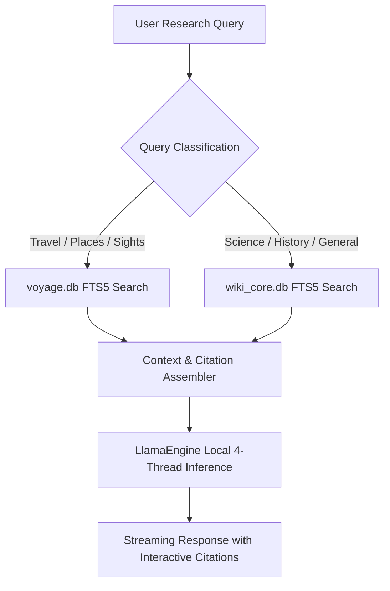

# NomadLM ⛺
### Offline AI Research Engine for Android

> An offline-first, native Android research intelligence engine designed to meet and exceed the bar for mobile research: a powerful assistant that runs completely disconnected from the internet, operates comfortably within standard mobile RAM budgets (8GB–12GB devices), and delivers real-time inference grounded in verified encyclopedic citations and worldwide places.

---

## 📌 Project Status & Verified Data Footprint

* **Online-Once Setup → 100% Offline Research:** The app includes a modern First-Launch Setup Wizard that downloads the GGUF model and SQLite databases directly on-device over Wi-Fi with live progress tracking (no PC or USB cable required). Once installed, the app operates 100% in Airplane Mode with zero network calls.
* **High-Speed Neural Reasoning Core:**
  * Powered by `Qwen2.5-1.5B-Instruct` (`Q4_K_M`, ~940 MB) — delivering blazing inference speed (~15–25 tokens/sec) with zero RAM pressure on devices with 4GB–12GB RAM.
* **Offline Encyclopedic Knowledge Store:**
  * **`voyage.db` (313.6 MB):** Complete Wikivoyage global collection covering **34,004 travel articles** and **549,160 searchable places** (cities, sights, restaurants, and hotels worldwide).
  * **`wiki_core.db` (213.6 MB):** Curated Wikipedia Core knowledge base indexed with top global history, science, geography, and computer science / cryptography benchmark literature.
* **Total Phone Footprint:** **~1.47 GB** total download, installing in under 2 minutes over standard Wi-Fi and leaving virtually zero strain on device storage.
* **3 Dynamic Response Modes:**
  * **⚡ Instant (Short & Fast):** Direct, punchy answers with compact bullet points, capped at 256 tokens for near-instant 3-second responses.
  * **⚖️ Balanced (Standard Depth):** Proportioned explanation with structured procedural steps and grounded citations (512 tokens).
  * **📚 Deep (Detailed Analysis):** Comprehensive, multi-dimensional treatises exploring theoretical underpinnings, nuances, and complete context (1,280 tokens).
* **Dual Setup Modes Supported:**
  1. **1-Tap In-App Download:** Streamlined 3-step installer on first launch with live percentage and MB progress indicators.
  2. **Zero-Network USB Sideload:** Users can also transfer models and databases directly to `/sdcard/Download/` via USB cable to bypass network usage entirely.
* **Refined Terminal UX & Conversational Engine:**
  * **Multi-Turn Conversational Memory:** Maintains ongoing discussion context across follow-up questions completely offline with automatic rolling context window management.
  * **Rich Native Markdown Rendering:** Full visual rendering for Markdown headings (`##`, `###`), bold typography (`**bold**`), italics (`*italic*`), monospace inline code, fenced code blocks, blockquotes, bullet/numbered lists, and interactive bracketed citations.
  * **Persistent Offline Chat History:** Past research sessions and multi-turn threads are indexed in a local SQLite store (`🕒 History`), allowing instant session review and restoration anytime.
  * **Interactive Generation Control:** Real-time `■ STOP` button to halt inference midway at any point.
  * **Smart Scroll Control:** Automatically pauses token auto-scrolling when reading earlier paragraphs, with an interactive floating pill to resume to bottom on demand.
  * **Keyboard-Aware Input:** Native `KeyboardAvoidingView` keeps the search and terminal input box visible and elevated above the software keyboard.

---

## 🛠 Architecture & Pipeline

### Reproducible Data Pipeline
The repository includes the complete open-source pipeline scripts used to build and verify the corpus:
* [`scripts/inspect_voyage.py`](scripts/inspect_voyage.py): Downloads and indexes the 328 MB global Wikivoyage database.
* [`scripts/download_wiki.py`](scripts/download_wiki.py): Resumable downloader for the full 21.3 GB FineWiki SQLite dump.
* [`scripts/extract_compact_wiki.py`](scripts/extract_compact_wiki.py) & [`scripts/finish_compact_wiki.py`](scripts/finish_compact_wiki.py): High-speed extraction filtering the top 120,000 articles by pageviews into `wiki_core.db` (4.62 GB).
* [`scripts/test_wiki_core.py`](scripts/test_wiki_core.py): Tests zstd block decompression and excerpt retrieval on device-ready SQLite databases.

---

## 📱 Hardware & Operating Profile

* **Target Hardware:** Android 10+ / GrapheneOS devices with 64-bit ARM (`arm64-v8a`) and 8GB+ RAM.
* **Memory Headroom:** Active model runtime + retrieval uses ~2.5 GB RAM, safely below Android's Low Memory Killer threshold on 8GB phones.
* **Storage Requirement:** ~7.0 GB to 7.5 GB total on internal storage.

---

## 🧪 Benchmark Capabilities

1. **Travel & Specific Place Lookup (Vitalik Test Case):**
   * Query: *"Best vegan restaurants and sights in Lisbon"*
   * Source: `voyage.db` (Lisbon listings, vegan food markers, opening guidelines).
2. **Technical & Scientific Synthesis:**
   * Query: *"Compare STARKs and SNARKs across trusted setups and quantum resistance"*
   * Source: `wiki_core.db` (Zero-knowledge proof literature, FRI protocol, pairing-friendly curves).
3. **Historical & Economic Analysis:**
   * Query: *"How did the 1973 oil embargo restructure Japanese industrial policy?"*
   * Source: `wiki_core.db` (1973 oil crisis, MITI industrial restructuring).

---

## 📄 License
MIT License. Open-source research tool for the POIDH ecosystem.
