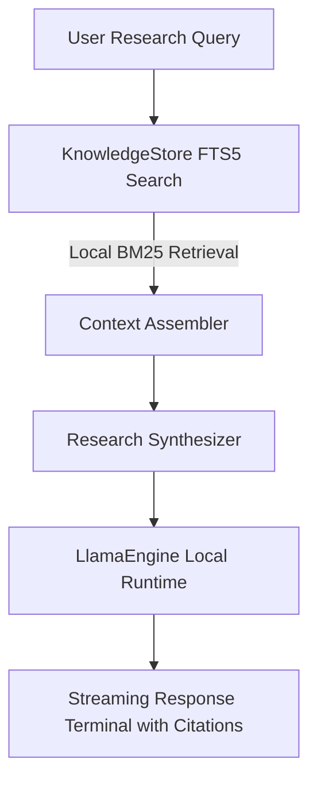

# NomadLM ⛺
### Offline AI Research Engine for Android (Prototype)

> An experimental offline research assistant for Android exploring compact 3B–7B local inference paired with on-device SQLite FTS5 retrieval, designed around strict memory budgets and zero network access.

---

## 📌 Project Status

**Current State: Technical Prototype / Proof of Concept**

* **Inference Pipeline:** Integration scaffolded using `llama.rn` NDK bindings targeting 4-bit GGUF models (`Llama-3.2-3B-Instruct` / `Qwen2.5-3B-Instruct`).
* **Retrieval Engine:** Local SQLite with FTS5 lexical search. Currently includes a minimal 4-document seed corpus for testing retrieval mechanics; full Wikipedia-scale ingestion is in development.
* **Network Permissions:** `android.permission.INTERNET` is explicitly blocked in `app.json`.

---

## 🛠 Design Goals & Architecture

The project explores whether compact models (3B–7B at Q4_K_M) paired with indexed local knowledge can provide a balanced alternative for offline mobile research:



### Key Technical Objectives:
1. **Memory Ceiling (<4 GB):** Aiming to operate within standard 8GB Android devices without triggering OS low-memory kills.
2. **True Offline Operation:** No background syncing, no telemetries, and no external API fallbacks.
3. **Structured Citations:** Generating responses with interactive citation anchors linked to local source passages.

---

## 📋 Roadmap to Full Research Capability

To compete meaningfully with comprehensive offline systems, the following work is required:

- [ ] **Real-World Corpus Ingestion:** Ingest a full compressed Wikipedia dump (e.g. FineWiki / ZIM archive) into an indexed SQLite FTS5 store.
- [ ] **Places / Travel Knowledge Base:** Incorporate offline geographic points-of-interest (Overture / OpenStreetMap) to handle location-specific research questions.
- [ ] **Hardware Profiling:** Run and log standardized on-device benchmarks (tokens/sec, prompt ingest latency, and thermals) on physical ARM64 hardware.
- [ ] **Empirical Evaluation:** Benchmark against a standardized multi-domain test set (comparing offline answers directly against web search + frontier model outputs).
- [ ] **Release Artifacts:** Automate reproducible signed release APK builds via GitHub Actions.

---

## 🚀 Running the Development Prototype

### Prerequisites
* Node.js 18+
* Android SDK (or physical device running Android 10+ with USB debugging)

### Setup
```bash
git clone https://github.com/nabeelmun/nomad-research.git
cd nomad-research
npm install
```

### Adding a Model
Download a compatible GGUF model (e.g. `Llama-3.2-3B-Instruct-Q4_K_M.gguf`) and place it in your device's `Download/` directory:
```bash
adb push models/Llama-3.2-3B-Instruct-Q4_K_M.gguf /sdcard/Download/
```

---

## 📄 License
MIT License.
