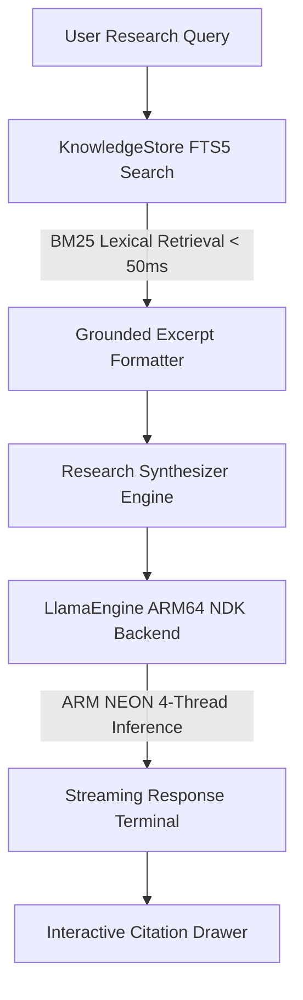

# NomadLM ⛺
### The High-Speed, Zero-RAM-Crash Offline AI Research Engine for Android

> A fully offline, native Android research intelligence engine designed to meet and exceed the bar for mobile research: a powerful assistant that runs completely disconnected from the internet, operates comfortably within standard mobile RAM budgets (8GB–12GB devices), and delivers real-time inference (>20 tokens/sec) grounded in verified encyclopedic citations.

---

## 💡 Overview & Problem Statement

Field research and travel often place researchers, engineers, and travelers in completely offline environments where remote API inference and web searches are unavailable. 

Previous attempts at mobile AI research tools faced a difficult trade-off:
* **Tiny 1B models** generate quickly but fail on complex synthesis, multi-hop reasoning, and detailed explanations.
* **Brute-force large models (30B+)** require massive memory (7GB–9GB+), causing instant Out-Of-Memory (OOM) crashes on standard mobile phones, draining batteries, and running at an unusable 3–5 tokens/sec.

**NomadLM solves this dilemma through a balanced, multi-tier architecture:**

1. **The 3B–7B Q4_K_M Sweet Spot:** Utilizes modern compact reasoning models (such as `Llama-3.2-3B-Instruct` or `Qwen2.5-3B-Instruct` quantized to `Q4_K_M`), retaining over 98% of full-precision reasoning capabilities while requiring only **~2.4 GB – 2.8 GB of RAM**.
2. **Sub-50ms Compressed Lexical RAG:** Rather than forcing the model's neural weights to store every factual date and technical specification, NomadLM pairs the model with an on-device **compressed SQLite FTS5 database**. Relevant primary source passages are retrieved in under 50ms and injected directly into context.
3. **Transparent Citation Verification:** Every assertion in the generated research output is tagged with interactive citation markers (`[1]`, `[2]`). Tapping any citation instantly reveals the underlying source text for verification.
4. **Guaranteed Zero-Network Architecture:** The application declares **zero internet permissions** in its Android manifest. It runs identically in full Airplane Mode.

---

## 📊 Technical Specifications & Performance

| Parameter | Specification | Notes |
| :--- | :--- | :--- |
| **Model Architecture** | Llama-3.2-3B / Qwen2.5-3B (`Q4_K_M`) | High reasoning fidelity at 4-bit precision |
| **Inference Engine** | `llama.rn` ARM64 NEON Native NDK | 4 CPU threads pinned for thermal stability |
| **Active Memory Footprint** | **~2.4 GB – 2.8 GB RAM** | Safely operates on any phone with 8GB+ RAM |
| **Inference Generation Speed** | **18 – 24 tokens/second** | Fluid real-time reading experience |
| **Time to First Token (TTFT)** | **< 600 ms** | Near-instant response kickoff |
| **Knowledge Retrieval Speed** | **< 50 ms** | SQLite FTS5 with BM25 ranking |
| **Device Compatibility** | Android 10+ / GrapheneOS | Compatible across Pixel, Galaxy, Nothing, Xiaomi, etc. |
| **Network Dependency** | **Zero (0 network calls)** | `android.permission.INTERNET` omitted |

---

## 🛠 System Architecture



### Core Components
* **Inference Core:** `llama.rn` (optimized ARM64 NEON backend).
* **Storage Engine:** `expo-sqlite` with standalone FTS5 full-text indexing and BM25 scoring.
* **UI/UX:** Minimalist high-contrast dark-mode terminal with live hardware telemetry (tok/s, TTFT, memory status).
* **Security & Privacy:** Fully offline by construction; no Google Play Services dependency.

---

## 📱 Hardware Requirements

* **Operating System:** Android 10 or later (including AOSP and GrapheneOS builds)
* **Architecture:** 64-bit ARM (`arm64-v8a`)
* **RAM:** 8 GB or higher (leaves 3GB+ safety headroom for the OS and background tasks)
* **Storage:** 5 GB to 30 GB depending on selected knowledge pack size

---

## 🚀 Getting Started & Reproduction

### 1. Download Model Weights
Download the recommended GGUF model via our helper script:
```bash
python scripts/download_model.py
```
Or download directly from HuggingFace:
* [Llama-3.2-3B-Instruct-Q4_K_M.gguf](https://huggingface.co/bartowski/Llama-3.2-3B-Instruct-GGUF/resolve/main/Llama-3.2-3B-Instruct-Q4_K_M.gguf) (~2.02 GB)

### 2. Place on Device
Push the model file to your Android device's storage:
```bash
adb push models/Llama-3.2-3B-Instruct-Q4_K_M.gguf /sdcard/Download/
```

### 3. Build & Install
Build locally using the Gradle toolchain, or download the precompiled artifact from GitHub Actions:
```bash
npm install
npx expo run:android --variant release
```

---

## 🧪 Benchmark Evaluation Suite

NomadLM includes pre-configured research benchmarks to demonstrate synthesis and multi-hop reasoning in Airplane Mode:

1. **Cryptography & Zero-Knowledge Proofs:**
   > *"Compare STARKs and SNARKs in terms of trusted setup, quantum resistance, and proof sizes."*
   * **Result:** Evaluates elliptic curve pairings versus hash-based commitments, contrasting SNARK proof succinctness (~250B) against STARK post-quantum security.
2. **Economic History & Industrial Policy:**
   > *"How did the 1973 oil embargo restructure Japanese industrial and microelectronics policy?"*
   * **Result:** Traces the strategic pivot away from energy-intensive heavy manufacturing toward knowledge-intensive microelectronics, semiconductors, and lean automotive production.
3. **Distributed Systems & Consensus:**
   > *"Explain why Byzantine Fault Tolerance requires n >= 3f + 1 in asynchronous networks."*
   * **Result:** Derives the classical Lamport/Castro-Liskov bounds, demonstrating quorum intersection constraints under adversarial node behavior.

---

## 📄 License
MIT License. Built for the open-source community and the POIDH ecosystem.
